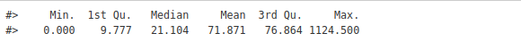

# Construção de diagramas de controle estatísticos aplicados à vigilância em saúde, especificamente no monitoramento da dengue (R)

<br>

<div align="center">
    <div style="display: flex; align-items: center;">
        
    </div>
</div>

<br> 

#

Este repositório contém o código para a construção de diagramas de controle estatísticos aplicados à vigilância em saúde, especificamente no monitoramento da dengue. O objetivo é utilizar técnicas de controle estatístico de processos (CEP) para analisar dados epidemiológicos, identificar padrões e detectar possíveis surtos de dengue com base em indicadores como número de casos confirmados, taxa de incidência e outros fatores relacionados.

O projeto foi desenvolvido utilizando a linguagem R, com foco em análise exploratória de dados, visualização e modelagem de séries temporais. Ele inclui a construção de diferentes tipos de diagramas de controle (como gráficos de médias, amplitude e outros) e a aplicação de métodos estatísticos para avaliar a eficácia das intervenções de saúde pública e monitorar a evolução da doença.

Objetivos:

*   Construir diagramas de controle para a análise de dados de dengue.
*   Detectar surtos e tendências de forma antecipada.
*   Propor melhorias nos processos de vigilância em saúde utilizando análise de dados.
*   Implementar as melhores práticas de visualização de dados para comunicar as descobertas.


Tecnologias Utilizadas:

*   linguagem R
*   Bibliotecas R: ggplot2, qcc, dplyr, tidyr, entre outras.
*   Métodos estatísticos: Controle de qualidade, Análise de séries temporais.


# 1 Introdução ao diagrama de controle

Na vigilância em saúde, o diagrama de controle é utilizado para definir os limites esperados de uma doença ao longo do tempo, permitindo identificar rapidamente a ocorrência de epidemias ou surtos. Ele facilita a detecção precoce de aumentos de casos, ajudando as equipes de saúde a tomarem medidas preventivas de forma eficiente. 

Para construir o diagrama, a metodologia mais comum utiliza a mediana semanal dos casos notificados ao longo de um período de 10 anos, excluindo anos epidêmicos para evitar resultados enviesados. O diagrama de controle é composto por três componentes: o limite superior (indicando o limiar epidêmico), a média de casos (representando o nível endêmico) e a distribuição dos casos observados. 

Esses componentes são visualizados em um gráfico, com a linha representando a média e o limite superior, e as barras indicando a distribuição dos casos observados, com a unidade temporal sendo a semana epidemiológica e o eixo y a frequência dos casos.


<br>

<div align="center">
    <div style="display: flex; align-items: center;">
        
    </div>
</div>

<br> 

Assim, concluímos que nosso diagrama de controle é composto por:

*   Linha laranja tracejada: limite superior de casos esperados em cada semana epidemiológica considerando-se os dados referentes aos anos anteriores não epidêmicos.
*   Linha azul escura: média de casos calculada com base nessa série histórica pregressa.
*   Barras em azul claro: número de casos observados por semana epidemiológica no ano estudado.


# 2. Construindo o diagrama de controle de dengue

Utilizaremos dados de dengue como exemplo para demonstrar o método mais aplicados para monitoramento: o diagrama de controle semanal. As arboviroses são doenças constantemente monitoradas e de relevância epidemiológica em vários municípios do país, principalmente dengue, zika e chikungunya. O Brasil é o país que mais contribui com suas magnitudes nas Américas. Assim acompanhar suas trajetórias é uma atividade realizada com frequência pelas vigilâncias e pode se tornar muito difícil em anos epidêmicos.

Para essa prática, vamos demonstrar a coleta de dados de dengue e a elaboração do diagrama de controle com apoio da linguagem R, de forma a automatizar este processo de avaliação que nos é rotineiro

# 2.1 Obtendo os dados

O InfoDengue é uma plataforma desenvolvida pela Fiocruz e pela Fundação Getúlio Vargas, que realiza o monitoramento e emite alertas sobre arboviroses no Brasil, incluindo dengue, chikungunya e zika. Através de seu site (https://info.dengue.mat.br/report/), é possível acessar boletins epidemiológicos e séries temporais de casos notificados por diversos municípios brasileiros. Além de fornecer dados sobre a incidência de casos, o sistema também disponibiliza informações sobre variáveis ambientais, como temperatura e umidade, que podem ser úteis na análise da propagação dessas doenças.

<br>

<div align="center">
    <div style="display: flex; align-items: center;">
        
    </div>
</div>

<br> 


Para a análise proposta, utilizaremos a <b> série histórica de dengue da cidade de Foz do Iguaçu, no Paraná,</b> com dados organizados por semana epidemiológica no <b> período de 2012 a 2022</b>. Esses dados serão acessados por meio da API do <b> InfoDengue</b> , o que permitirá não apenas automatizar a análise, mas também otimizar a coleta contínua e atualizada de dados. Com isso, será possível realizar uma avaliação mais dinâmica e eficiente do comportamento da epidemia ao longo dos anos, facilitando a identificação de tendências e padrões que podem indicar surtos ou epidemias.

Os pacotes necessários para importar a API e criar o diagrama de controle de dengue são:

<b> 1.  tidyverse </b> – Conjunto de pacotes para manipulação de dados, como dplyr e ggplot2.

<b> 2.  lubridate </b>  – Para facilitar o trabalho com datas e horários.

<b> 3.  xts </b>  – Para trabalhar com séries temporais, como a manipulação de dados por data.

Esses pacotes são essenciais para a análise de dados e a construção de gráficos, como o diagrama de controle.


```R
# Instalando os pacotes necessários
if(!require(tidyverse)) install.packages("tidyverse"); library(tidyverse)
if(!require(lubridate)) install.packages("lubridate"); library(lubridate)
if(!require(foreign)) install.packages("foreign"); library(foreign)
if(!require(xts)) install.packages("xts"); library(xts)
```

Os objetos necessários para gerar uma consulta à API do InfoDengue:
*   url: o endereço eletrônico (URL) da API,

*   geocode: o código do município segundo IBGE de Foz do Iguaçu, que é 4108304,

*   format: o formato dos dados; utilizaremos o arquivo do tipo .csv,

*   disease: a arbovirose de interesse, que será a dengue,

*   ew_start e ew_end: o período que será estudado, a semana epidemiológica de início (1) e fim (53); aqui, em geral, pode-se selecionar parte de um ano, mas quando lidamos com séries anuais basta deixar 52 ou 53, 

*   ey_start e ey_end: os anos de início e fim de nossa série histórica: 2012 e 2022 no nosso exemplo.


```R
 Atribuição de dados para consultar a API do InfoDengue
url <- "https://info.dengue.mat.br/api/alertcity?"  
# inserimos o endereço do InfoDengue
geocode <- 4108304  # indicamos código do IBGE de Foz do Iguaçu
disease <- "dengue" # selecionamos a doença
format <- "csv"     # indicamos o formato de arquivo que será baixado
ew_start <- 1       # indicamos o início da semana epidemiológica 
ew_end <- 53        # indicamos o final da semana epidemiológica
ey_start <- 2012    # indicamos o início do ano a ser exportado
ey_end <- 2022      # indicamos o final do ano a ser exportado
```

Neste passo, vamos concatenar os objetos que criamos no Passo 2 para formar uma URL, ou seja, um link que irá acessar a API e retornar os dados solicitados no formato .csv. Utilizando a função paste0(), programaremos o R para fazer a consulta automaticamente e armazenar os dados no objeto chamado {consulta}.

Funções Utilizadas:

*   paste0() – Concatena strings sem adicionar espaços entre elas.

```R
# programando o R para ele trazer os dados diretamente da internet
consulta <- paste0(url,
                   "geocode=", geocode,
                   "&disease=", disease,
                   "&format=", format,
                   "&ew_start=", ew_start,
                   "&ew_end=", ew_end,
                   "&ey_start=", ey_start,
                   "&ey_end=", ey_end)

# visualizando o link armazenado no objeto {`consulta`}
consulta
```


# 2.2 Montando o diagrama de controle

Até este ponto, já temos os dados necessários para construir o diagrama de controle da dengue e analisar se há uma epidemia ou endemia no município de Foz do Iguaçu/PR em 2022. Agora, precisamos escolher as variáveis que serão utilizadas na análise. Esta etapa é fundamental para garantir que estamos utilizando as informações corretas para a construção do diagrama de controle.

Para tomar essa decisão, é necessário consultar o dicionário de dados do InfoDengue, que está disponível no site. O dicionário contém informações sobre as variáveis coletadas e como elas podem ser utilizadas para monitorar os casos de dengue. Acesse o link para visualizar o dicionário de dados e escolha as variáveis mais apropriadas para a construção do diagrama de controle: [Dicionário de Dados - InfoDengue](https://info.dengue.mat.br/services/api)

<br>

<div align="center">
    <div style="display: flex; align-items: center;">
        
    </div>
</div>

<br> 

Neste exemplo, selecionamos três variáveis essenciais da tabela de dados do InfoDengue para a construção do diagrama de controle:

*   data_iniSE: Data de início da semana epidemiológica (SE)
*   casos: Número de casos de dengue na semana epidemiológica
*   p_inc100k: Incidência de dengue por 100 mil habitantes na semana epidemiológica

Além dessas variáveis, o InfoDengue oferece outras informações que podem ser úteis para a avaliação da situação da dengue, como:

*   Temperatura mínima
*   Umidade máxima
*   Número de tweets relacionados ao tema no município (monitoramento de rumores)

Essas variáveis adicionais podem ser exploradas para ampliar a análise, se necessário.

Para o próximo passo criaremos um novo objeto, o {foz_ts}. Ele será do tipo série temporal. Para isso, utilizaremos a função xts() do pacote xts. Para utilização da função será necessário definir dois argumentos:

*   x: argumento que deverá indicar os dados a serem plotados. Ou seja, colocaremos no x a coluna da base de dados {dengue_foz} com os valores da incidência de casos (p_inc100k).
*   order.by: argumento que deverá indicar a data correspondente aos dados indicados no argumento x. Aqui, utilizaremos a coluna com os valores da data de início das semanas epidemiológicas (data_iniSE).

```R
# criando o objeto {`foz_ts`}
foz_ts <- xts(
  
  # selecionando a variável com os dados da incidência de dengue
  x = dengue_foz$p_inc100k,
  
  # selecionando a variável que contém as datas correspondentes
  order.by = dengue_foz$data_iniSE)
```

```R
# Plotando o diagrama de controle
plot(
  # indicando a série temporal
  x = foz_ts,
  
  # colocando o título do gráfico
  main = 'Distribuição da incidência de dengue em Foz do Iguaçu/PR',
  
  # escrevendo o título do eixo y
  ylab = 'Incidência p/ 100.000 hab.'
  )

```

<br>

<div align="center">
    <div style="display: flex; align-items: center;">
        
    </div>
</div>

<br> 

### Análise da Distribuição dos Valores de Incidência de Dengue

Ao analisarmos a distribuição dos valores de incidência de dengue na série histórica entre 2012 e 2022, utilizando a função summary(), observamos alguns pontos importantes:

1.  <b> Casos Mais Altos:</b> O pico mais alto de incidência de dengue foi registrado em 2016, quando o número de casos foi extremamente elevado em comparação aos demais anos da série temporal.

2. <b> Pico de 2020: </b> Em 2020, também houve um aumento significativo, estabelecendo o recorde do pico mais alto de casos de dengue registrado na série histórica analisada.

Essa análise nos permite identificar claramente os anos com maiores incidências de dengue, e com base nos limites do diagrama de controle, podemos investigar se esses anos representam períodos epidêmicos ou se estavam dentro da faixa endêmica esperada.


```R
# Analisando as estatísticas básicas do banco de dengue importado
summary(dengue_foz$p_inc100k)

```

<div align="center">
    <div style="display: flex; align-items: center;">
        
    </div>
</div>

<br> 
o output! A média de incidência (mean) é um pouco maior que 70 casos por 100 mil habitantes e a mediana é um pouco maior que 20 casos por 100 mil habitantes. Essa diferença entre média e mediana é um bom indicador de que há valores muito altos e extremos puxando a média para cima, ou seja, outliers que estão demonstrando uma distribuição assimétrica dos dados.

<br> 
<div align="center">
    <div style="display: flex; align-items: center;">
        
    </div>
</div>

### Análise da Distribuição da Incidência de Dengue com Boxplot

Para continuar avaliando a distribuição dos dados de incidência de dengue entre 2012 e 2022, utilizamos um gráfico do tipo boxplot. O boxplot permite observar o comportamento da taxa de incidência em cada ano, destacando quais anos se comportaram como outliers na série temporal.

A classificação dos anos será feita com base nos critérios do [Programa Nacional de Controle de Dengue](https://bvsms.saude.gov.br/bvs/publicacoes/pncd_2002.pdf):

- **Baixa incidência**: até 100 casos por 100 mil habitantes

- **Média incidência**: entre 101 e 299 casos por 100 mil habitantes (referência de 200 casos)

- **Alta incidência**: 300 casos ou mais por 100 mil habitante

Para facilitar a interpretação, sobrepomos ao boxplot linhas tracejadas representando essas faixas de incidência:

- **Linha tracejada azul** (blue) para indicar a **baixa incidência**,
- **Linha tracejada laranja** (orange) para indicar a **média incidência**,
- **Linha tracejada vermelha** (red) para indicar a **alta incidência**.

Essas linhas ajudam a identificar visualmente os anos com incidência de dengue dentro de cada faixa, além de destacar os outliers da série, que podem indicar anos com picos atípicos de casos.

### Executando o Boxplot e Adicionando Linhas de Incidência

Agora, vamos gerar o gráfico **boxplot()** para analisar a distribuição da incidência de dengue usando a variável **p_inc100k** da base de dados **{dengue_foz}**, estratificada pelo ano da data de início da semana epidemiológica **(data_iniSE)**. No **código R, a união** entre as variáveis é **indicada pelo símbolo ~ (til)**.

Definindo Eixos:
-   O título do eixo x será definido com **xlab**.
-   O título do eixo y será definido com **ylab**.

### Adicionando Linhas de Incidência:
Para destacar as faixas de baixa, média e alta incidência, utilizaremos a função abline(), onde podemos definir:

-   **h**: os valores no eixo y onde as linhas devem cruzar (representando as faixas de incidência),
-   **lty**: o tipo da linha (2 para linhas tracejadas),
-   **lwd**: a largura da linha,
-   **col**: as cores das linhas, definidas com c() para múltiplas cores.


```R
# Plotando gráfico boxplot com incidência por (`~`) ano
boxplot(dengue_foz$p_inc100k ~ year(dengue_foz$data_iniSE),
        ylab = 'Incidência por 100.000 hab.',
        xlab = "Ano de início da semana epidemiológica",

# Inserindo o título do boxplot
        main = "Distribuição da incidência anual de dengue em Foz do Iguaçu-PR 
		entre 2012-2022.")

# Criando linhas de análise a partir dos parâmetros que definimos
abline(
  h = c(300, 200, 70), 
  lty = 2,
  lwd = 2,
  col = c('red', 'orange', 'blue')
)
```  

<br> 
<div align="center">
    <div style="display: flex; align-items: center;">
        
    </div>
</div>

<br> 
 Observe que, embora tenhamos em 2013 taxas mais altas que os demais anos, apenas seus outliers tocam a linha de **cor laranja (média incidência)**. Ou seja, 2013 possui magnitude menor que os demais anos e o seu valor do terceiro quartil é inferior a 50%, por isso o incluiremos como ano não epidêmico. Assim, selecionaremos para a construção do diagrama de controle os anos de 2012, 2013, 2014, 2017 e 2018, pois são anos não epidêmicos - estão abaixo da baixa incidência de casos.